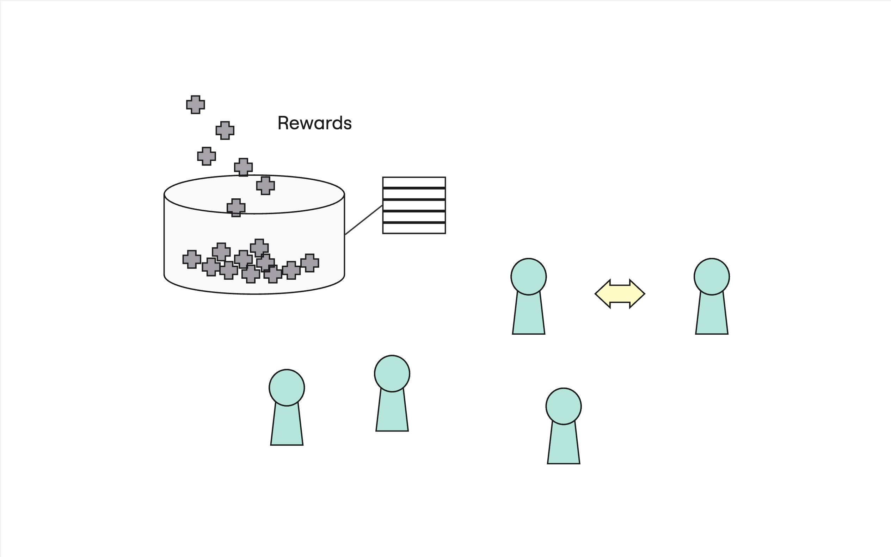

# Paladin Rewards Program



The Paladin Rewards program manages the distribution of rewards to token
holders based on their share of the total token supply. Holders earn shares of
rewards proportional to their share of token supply.

## Architecture

The program makes use of two types of accounts to manage the tracking of
eligible rewards - Holder Rewards Pool and Holder Rewards.

The Holder Rewards Pool is a global pool of reward funds that maintains a
governing rate of "rewards per token" for all holders to claim against.
Rewards are deposited directly into the pool using the `DistributeRewards`
instruction and can be claimed by holders.

```rust
struct HolderRewardsPool {
    /// The current rewards per token exchange rate.
    ///
    /// Stored as a `u128`, which includes a scaling factor of `1e9` to
    /// represent the exchange rate with 9 decimal places of precision.
    pub accumulated_rewards_per_token: u128,
}
```

A Holder Rewards account is assigned to each token holder and, together with
the Holder Rewards Pool, tracks the rewards a particular holder can claim.

```rust
struct HolderRewards {
    /// The rewards per token exchange rate when this holder last harvested.
    ///
    /// Stored as a `u128`, which includes a scaling factor of `1e9` to
    /// represent the exchange rate with 9 decimal places of precision.
    pub last_accumulated_rewards_per_token: u128,
    /// The amount of unharvested rewards currently stored in the holder
    /// rewards account that can be harvested by the holder.
    pub unharvested_rewards: u64,
    _padding: u64,
}
```

## Reward Calculation

The pool's `accumulated_rewards_per_token` is a constantly-increasing rate that
determines how many rewards each holder can claim on each token they hold. As
holders claim rewards, their Holder Rewards account stores the pool's rate at
their last claim. This is done to maintain proper accounting across changing
token balances, including transferring and burning.

The `accumulated_rewards_per_token` is calculated against the mint's total
supply, simply by dividing newly deposited rewards by the token's total
supply and adding that "marginal rate" to the current rate.

For example, consider a pool whose current rate is 5 rewards per token and
Alice has 100 tokens. She hasn't claimed before, so she's entitled to claim
500 rewards. She claims those rewards, and her Holder Rewards account stores
the rate of 5. Now, more rewards are deposited into the system, bringing the
rate up to 8 rewards per token. Since Alice last harvested 5 rewards per token,
and her token balance has not changed, she is now eligible for 3 rewards per
token - the difference between the current accumulated rate, and the rate she
last harvested at.

## Transfer Hook

The Paladin Rewards program also implements the SPL Transfer Hook interface,
and this hook functionality is paramount to preserving proper rewards
accounting.

During transfer, the hook implementation will essentially calculate each
holder's eligible rewards for their token balance _before the transfer_, move
those rewards into each Holder Rewards account's `unharvested_rewards`, then
update each account's `last_accumulated_rewards_per_token`.

This allows the program to basically "spy on" changes in token balances to
ensure transfers of tokens don't create opportunities to game the system.
